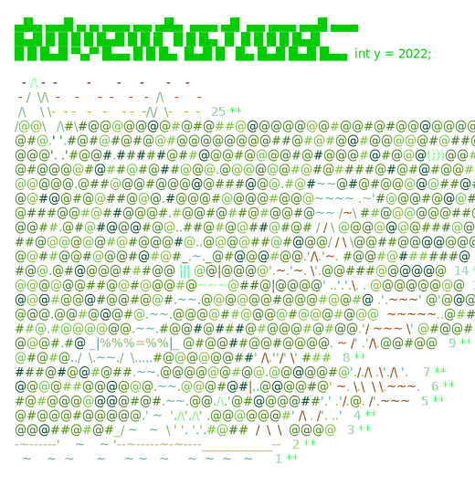

# Advent-Of-Code

My Solutions to [Advent of Code ](https://adventofcode.com/)
For my practice!

## Running Solution

To run files, put input data into `input.txt` file
Test Data uses `input-test.txt` file

To run test data, pass `True` to class instance at bottom
Ex:

```
# Python
if __name__ == "__main__":
    solution = Solution(True)
```

```
\\ Javascript
const solution = new Solution(true);
```

```
# Golang
func main() {
	solution := &Solution{
		UseTest: true,
	}
}
```

## Completed

- [ ] [2023](2023) (Python - in progress)
- [X] [2022](2022) (Python)
- [ ] [2021](2021)  ???
- [X] [2020](2020) (Python)
- [ ] [2019](2019) (Golang - not started)
- [X] [2018](2018) (Javascript)
- [X] [2017](2017) (Python)
- [X] [2016](2016) (Golang)
- [X] [2015](2015) (Javascript)

## AOC 2023

<a href="https://adventofcode.com/2022"></a>
